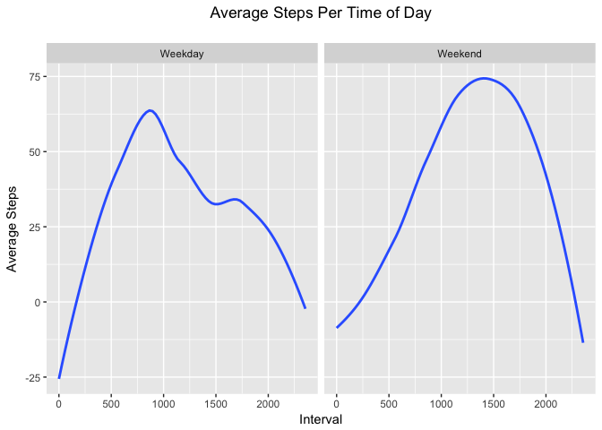

# Reproducible Research: Peer Assessment 1


## Load and preprocess the activity data


```r
library(lubridate)
library(dplyr)
data <- read.csv("activity.csv")
data <- mutate(data, date = ymd(data$date))
```

## What is the total number of steps taken per day?

### Histogram of steps per day

```r
steps_per_day <- tapply(
  data$steps, 
  data$date, 
  sum, 
  na.rm = TRUE)

hist(
  steps_per_day, 
  xlab = "Steps", 
  ylab = "Days", 
  main = "Histogram: Steps Per Day", 
  breaks = 8)
```

<!-- -->

## What is the mean and what is the median number of steps per day?


```r
mean(steps_per_day)
```

```
## [1] 9354.23
```

```r
median(steps_per_day)
```

```
## [1] 10395
```

## What is the average number of steps taken per 5-minute interval?


```r
average_steps_per_interval <- tapply(data$steps, data$interval, mean, na.rm = TRUE)
plot(
  x = names(average_steps_per_interval),
  y = average_steps_per_interval,
  type = 'l', 
  main = "Average Steps Per 5-Minute Interval",
  ylab = "Steps",
  xlab = "Interval")
```

<!-- -->

## What is the interval which contains, on average, the maximum number of steps?


```r
names(which.max(average_steps_per_interval))
```

```
## [1] "835"
```

## Impute missing values

### Total missing values


```r
nrow(data) - sum(complete.cases(data))
```

```
## [1] 2304
```

### Impute missing values with 0


```r
library(Hmisc)
imputed_data <- mutate(data, steps = impute(data$steps, 0))
```

## What is the impact of imputing missing data on the estimates of the total daily number of steps?

### Histogram of the total number of steps taken each day.


```r
steps_per_day_imputed <- tapply(
  imputed_data$steps, 
  imputed_data$date, 
  sum)

hist(steps_per_day_imputed,   
  xlab = "Steps", 
  ylab = "Days", 
  main = "Histogram: Steps Per Day", 
  breaks = 8)
```

<!-- -->

### Mean and Median total number of steps per day (with imputation)

```r
mean(steps_per_day_imputed)
```

```
## [1] 9354.23
```

```r
median(steps_per_day_imputed)
```

```
## [1] 10395
```

### Delta between mean and median total steps per day with/without imputation


```r
mean(steps_per_day_imputed) - mean(steps_per_day)
```

```
## [1] 0
```

```r
median(steps_per_day_imputed) - median(steps_per_day)
```

```
## [1] 0
```

Answer: Since `0` was chosen as the imputation value, there was no impact on the mean and median total steps per day.

## Are there differences in activity patterns between weekdays and weekends?

### Preparing data


```r
imputed_data <- mutate(
  imputed_data, 
  weekpart = factor(
    ifelse (
      weekdays(data$date) %in% c("Saturday", "Sunday"),  
      "Weekend", 
      "Weekday")))
```

### Plot of the average number of steps taken per 5-minute interval averaged across all weekday/weekend days.


```r
library(ggplot2)
average_steps_per_interval_imputed <- 
  imputed_data %>%
    select(steps, weekpart, interval) %>%
    group_by(weekpart, interval) %>%
    summarise(avg_steps = mean(steps))

ggplot(average_steps_per_interval_imputed, aes(x = interval, y = avg_steps)) + 
  xlab("Interval") + 
  ylab("Average Steps") + 
  ggtitle("Average Steps Per Time of Day\n") + 
  geom_smooth(se=FALSE) + 
  theme(plot.title = element_text(hjust = 0.5)) + 
  facet_grid(.~weekpart)
```

<!-- -->
